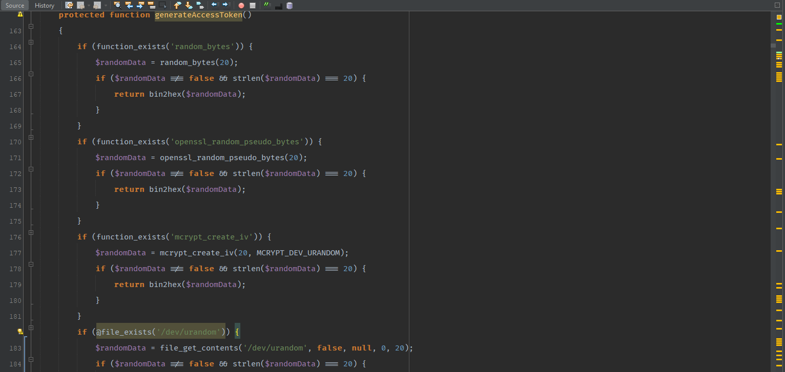
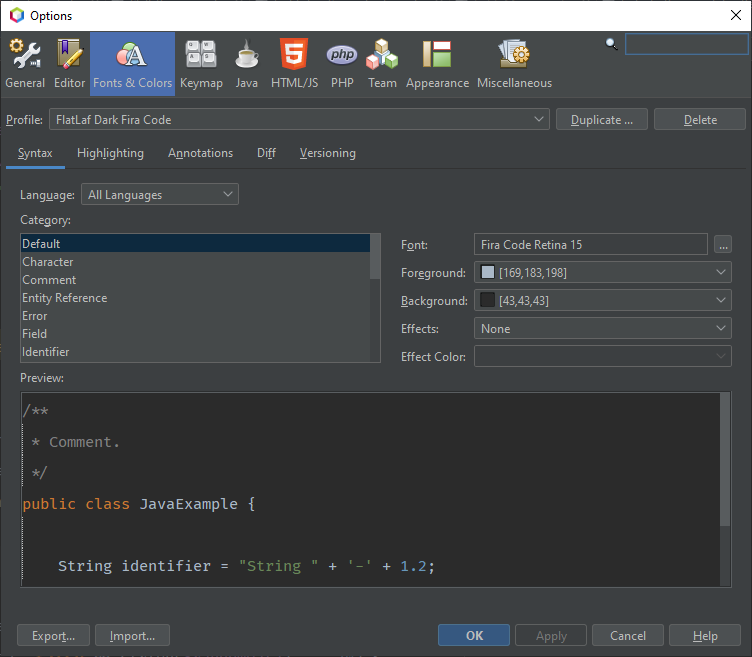

# netbeans-dark-mode

1. This repo contains `custom-netbeans.zip` file which you can import and get line-height in netbeans and dark mode. Import that settings in your Netbeans.  
2. Screenshots folder shows how it will look and Which fonts I'm using.

## Screenshots

### Increase line height Manually
[https://stackoverflow.com/questions/7581101](https://stackoverflow.com/questions/7581101)

### FiraCode is not available in my Fonts list
1. Click this link [https://github.com/tonsky/FiraCode](https://github.com/tonsky/FiraCode) and follow instructions to get FiraCode installed in your System. 
2. Then restart Netbeans once. Then after you will be able to see in settings. 